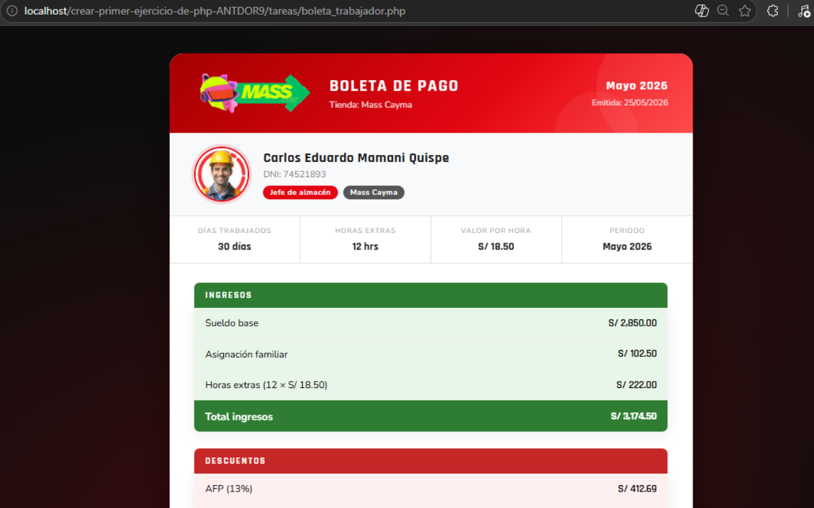

[](https://classroom.github.com/a/qgPz8yb8)
 
# Boleta de Pago — Minimarket Mass
 
Tarea T01 del curso Backend Developer Web — SENATI CFP Arequipa.
Genera una boleta de pago mensual de un trabajador peruano usando PHP,
calculando descuentos de ley y mostrando el sueldo neto en una página HTML profesional.
 

 
## 📁 Estructura del proyecto
 
```
tareas/
├── boleta_trabajador.php
├── 📂 css/
│   └── boleta.css
├── 📂 js/
│   └── boleta.js
└── 📂 img/
    ├── logo_mass.png
    ├── perfil.jpg
    ├── favicon.png
    └── preview.png
```
 
## Cálculos incluidos
 
- Sueldo base, asignación familiar y horas extras
- Descuento AFP (13%) e Impuesto a la Renta (8%)
- Sueldo neto a pagar
- Bonus: EsSalud del empleador, costo total empresa y sueldo proporcional a 22 días
## Autor
 
Anthony Dorian — SENATI CFP Arequipa · 2026
